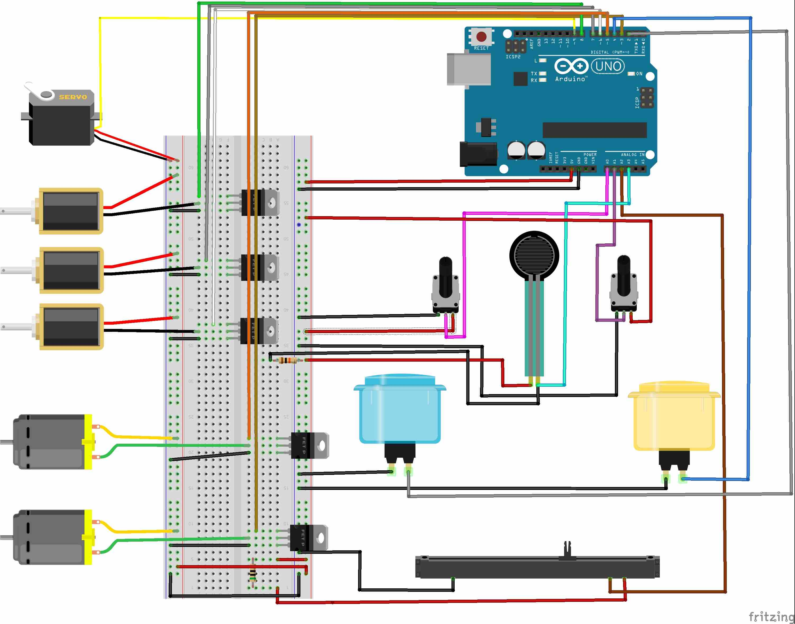

# Olivia Piano

## What is it

Code for Olivia's prepared piano

## What does it involve

At the moment there:

-   x2 Push Buttons
-   x3 Potentiometers
    -   x1 Slider
    -   x2 Rotary
-   x1 Force-Sensing Resistor
-   x3 Solenoids
    -   x2 Single Fire
    -   x1 Rapid Fire
-   x1 Servo
-   x2 DC Motors

## Pin out

In the current version of the code, this is the pinout, though this can be changed at any time

| Device         | Arduino Pin |
| :------------- | :---------- |
| Yellow Button  | `2`         |
| Blue Button    | `4`         |
| Left Pot       | `A0`        |
| Right Pot      | `A1`        |
| Slide Pot      | `A2`        |
| Force Resistor | `A3`        |
| Solenoid 1     | `8`         |
| Solenoid 2     | `7`         |
| Rapid Solenoid | `~6`        |
| Servo Scraper  | `~9`        |
| Motor 1        | `~3`        |
| Motor 2        | `~5`        |

## Control Map

| Input          | Output               |
| :------------- | :------------------- |
| Yellow Button  | Solenoid 1 Fire      |
| Blue Button    | Solenoid 2 Fire      |
| Left Pot       | Rapid Solenoid Speed |
| Right Pot      | Motor 1 Speed  |
| Slide Pot      | Servo Scraper Position        |
| Force Resistor | Motor 2 Speed        |

## Wiring

Wiring is a little chaotic, but here is a wiring diagram for illustration.

